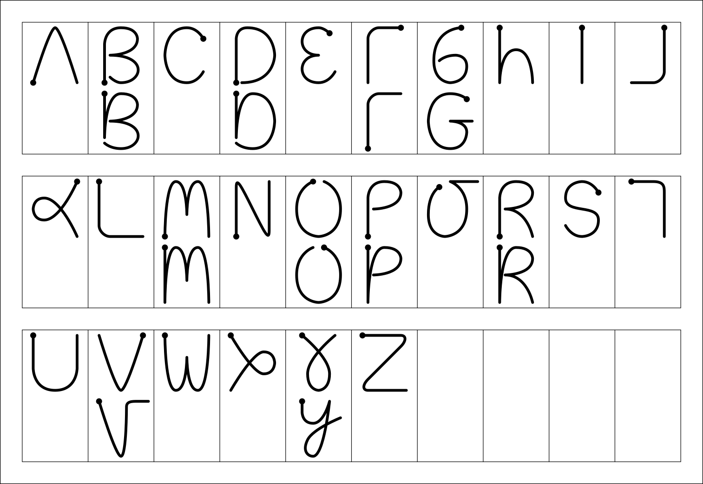
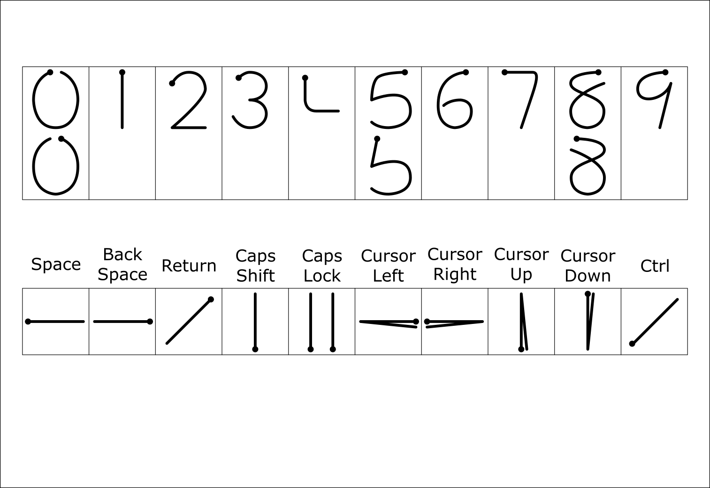
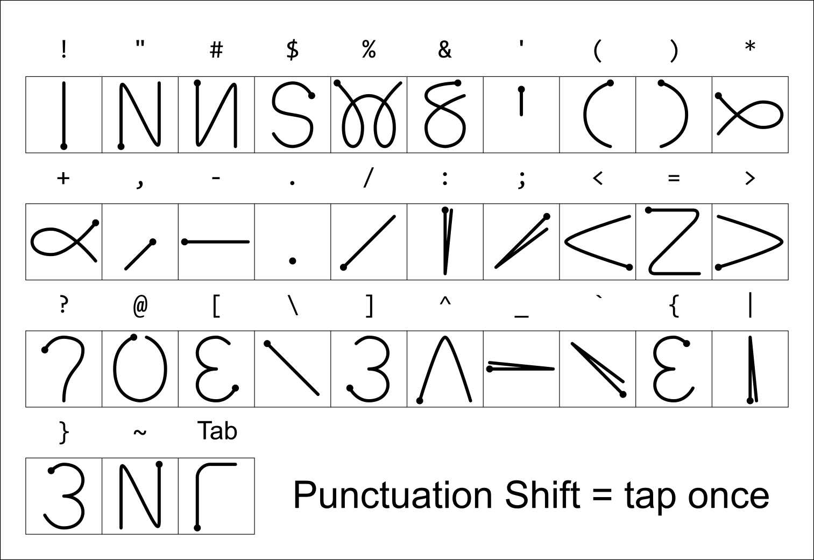

# ユーザーマニュアル

### 1. モードの切り替え

- **かな・カナ切替**: `q`
 - ひらがな → カタカナ (→ 半角カタカナ ※設定有効時) の順でトグルします。
- **英数モード (ASCII)**: `l`
 - 半角英数入力に切り替わります。
- **全角英数モード**: `L`
 - 全角英数入力に切り替わります。
- **Abbrev モード**: `/`
 - アルファベットを直接入力して、英単語から漢字への変換などがおこなえます。
- **ひらがなに戻る**: `Ctrl-j`
 - どのモード・状態からでも、ひらがなモード（通常状態）へ戻ります。

### 2. 漢字変換

#### 基本的な流れ

1. **読みの入力 (▽)**: `Shift` キーを押しながら最初の文字を入力します（例: `Shift-K` `a` `n` `j` `i` → ▽かんじ → `Space` → ▼漢字）
2. **送り仮名の入力**: 読みの途中で `Shift` キーを押しながら送り仮名の最初の文字を入力します（例: `Shift-U` `g` `o` `Shift-K` → ▽うご*k → `u` → ▼動く）
3. **変換の実行**: `Space` キーを押すと、第1候補が表示されます（▼）
4. **候補の選択**: `Space` キーや `→` キーで次の候補、`x` キーや `←` キーで前の候補を選択します
5. **確定**: `Enter` キー、または次の文字を入力することで選択中の候補を確定します

#### 応用的な変換操作

- **再変換**: `Ctrl-u` または `Ctrl-g` (直接入力時)
 - 直前に確定した単語を未確定状態（変換中）に戻してやり直します。
- **接頭辞・接尾辞入力**: `>` / `<` / `?`
 - 見出し語入力の開始時にこれらの記号を入力することで、接頭辞・接尾辞として辞書検索をおこないます。
- **継続変換（接尾語）**: `>` (変換中)
 - 候補を選択した状態で `>` を入力すると、その候補を確定した直後に接尾語（`>`）を付与した状態で見出し語入力を開始します。
- **動的候補**: `today`, `now`, `date`, `time` 等のキーワード
 - 見出し語入力中（▽）にこれらのキーワードを入力して `>` を押すと、現在の日時や時刻、和暦（令和等）を変換候補として表示します。
- **カタカナ確定**: `q` (見出し語入力中)
 - 入力中の読み（▽）を、変換を介さずそのままカタカナとして確定します。

#### 数値変換

辞書に登録された数値テンプレート（#0〜#5）に基づき、入力された数値を以下の形式に変換して表示します。

- **#0**: そのまま (例: 123)
- **#1**: 全角 (例: １２３)
- **#2**: 漢数字 (例: 一二三)
- **#3**: 位取りあり漢数字 (例: 百二十三)
- **#4**: 位取りあり漢数字・旧字体 (例: 壱百弐拾参)
- **#5**: 位取りあり混合表記 (例: 1億2345万6789)

### 3. 入力補完

- **補完の開始**: `Tab` または `Ctrl-i`
 - 見出し語入力中（▽）または Abbrev モード中に、辞書にある単語から補完候補を提示します。
- **補完の確定**: `.` (ピリオド)
 - 補完候補が選択されている状態でピリオドを押すと、その候補を確定します。

### 4. 個人辞書と学習

- **ユーザー辞書学習の有効/無効**:
 - 設定画面から、変換確定時の単語学習（順位の記憶や新規登録）を制御できます。
 - **無効時**: 候補選択をおこなっても学習されません。また、候補リストの末尾まで達した際に自動で単語登録モードへ移行せず、最初の候補に戻るようになります。
- **候補の削除**: `X` (Shift-x)
 - 変換中に `X` を押すと、現在選択している候補をユーザー辞書から削除できます。
- **辞書ツール**:
 - 設定画面の「辞書」から、登録された単語を一覧形式で確認・削除できます。

### 5. 状態別キー操作一覧

#### 通常モード（直接入力）

| キー操作 | 機能 |
|:-|:-|
| `q` | かな・カナ切替（ひらがな→カタカナ→半角カナ） |
| `l` | 英数（ASCII）モードへ切替 |
| `L` | 全角英数モードへ切替 |
| `/` | Abbrevモード（英単語漢字変換）へ切替 |
| `>` / `<` / `?` | 接頭辞・接尾辞トリガーによる見出し語入力開始 |
| `Ctrl-u` | 再変換（直前の確定を取り消して変換し直す） |
| `Ctrl-j` | ひらがなモードへ復帰 |

#### 見出し語入力中（▽）

| キー操作 | 機能 |
|:-|:-|
| `Space` | 変換開始 |
| `大文字 (Shift + Key)` | 送り仮名入力の開始（例：`Shift-T` で「▽...*た」） |
| `q` | 現在の読みをカタカナで確定 |
| `>` / `<` / `?` | 動的候補の表示 / 接頭辞・接尾辞を伴う変換開始 |
| `Ctrl-q` | 読みのかな/カナ切替 |
| `Tab` / `Ctrl-i` | 補完の開始・次候補選択 |
| `.` | 選択中の補完候補を確定 |

#### Abbrevモード

| キー操作 | 機能 |
|:-|:-|
| `Space` | 変換開始 |
| `Ctrl-q` | 入力中の英単語を全角英数で確定 |
| `Tab` / `Ctrl-i` | 補完の開始・次候補選択 |
| `.` | 選択中の補完候補を確定 |

#### 変換候補選択中（▼）

| キー操作 | 機能 |
|:-|:-|
| `Space` / `→` (DPAD) | 次の候補へ移動 |
| `x` / `←` (DPAD) | 前の候補へ移動 |
| `>` | 現在の候補を確定し、続けて接尾語（`>`）見出し語入力を開始 |
| `Ctrl-n` / `Ctrl-f` | 次の候補へ移動 |
| `Ctrl-p` / `Ctrl-b` | 前の候補へ移動 |
| `X` (Shift-x) | 現在選択中の候補を個人辞書から削除 |

#### 全般・共通操作

| キー操作 | 機能 |
|:-|:-|
| `Enter` | 現在の入力を確定 / 改行の挿入 |
| `Backspace` / `Ctrl-w` | 1文字削除 / 状態のキャンセル（変換中止など） |
| `Ctrl-j` | どの状態からでも「ひらがなモード」の通常状態へ復帰 |
| `Ctrl-g` | 入力の中断・キャンセル |

### 6. 設定オプション

- **句読点の切り替え**: 設定から `。、` (標準) と `．，` (学術・公用文向け) を選択可能です。
- **入力形式による自動切替**: URI 入力欄などで自動的に英数モードへ切り替える設定が可能です。
- **状態表示**: `▽` `▼` などの状態インジケータの表示/非表示を切り替えられます。
- **半角カタカナ**: カナトグル（`q`）に半角カタカナを含めるかどうかを設定できます。
- **SandS (Space and Shift)**: スペースキーを単独で押すとスペース、他のキーと同時に押すと Shift キーとして機能させる設定です。
- **ツールチップ**: モード変更時の通知表示時間を調整できます。
- **バイブレーション**: 画面キーボード操作時の触覚フィードバックを有効にできます。
- **候補表示位置**: 記号バー使用時に、候補リストをバーの上に重ねるか、独立して表示するかを選択できます。
- **バックアップ・復元**: 設定内容の保存と読み込みが可能です。

### 7. ローマ字かな変換表

詳細なローマ字かな変換ルールについては、[ROMAJI.md](ROMAJI.md) を参照してください。

### 8. ソフトウェアキーボード

物理キーボードの有無や好みに合わせて、画面上のキーボード表示を切り替えられます。

- **表示の切り替え**: 設定の「キーボードの種類」から「QWERTY」「タブレット」「記号バー」「ストローク」を選択できます。
 - 物理キーボードがない場合はデフォルトで **QWERTY** が選択されます。
 - **タブレット**: 数字キーや矢印キー、Tab、Ctrl 等を備えた、PC 用キーボードに近い 5 段配列のレイアウトです。大画面のデバイスでの使用に適しています。
 - 物理キーボードがある場合は、1行の記号入力補助である **記号バー** がデフォルトです。
- **QWERTY / タブレット / 記号バーの操作**:
 - `Shift`: 大文字入力（SKK の読み開始など）に使用します。**2回連続で押すとロック状態**になり、解除するにはもう一度押します。
 - `Ctrl`: `Ctrl-j` や `Ctrl-a` などの入力に使用します。一度押すと「ON」状態になり、次のキー入力に Ctrl が適用されます。
 - `Sym`: 記号のレイアウトに切り替えます。こちらも**2回連続で押すとロック状態**になり、記号入力を継続できます。解除するにはもう一度押すか、他のモードキー（Shift 等）を押します。
- **カスタマイズ**:
 - 設定画面から、各モード（通常・Shift・記号）のキー配置をドラッグ＆ドロップ操作で自由に編集可能です。
 - 各キーのウェイト（幅）や、特定の機能を割り当てた「機能キー」の配置も GUI 上で調整できます。
- **ストローク入力**:
 - 画面をなぞって文字を入力するGraffiti風の手書き入力方式です。画面左側がアルファベット、右側が数字に対応しています。
 - 画面から上の外側へのストロークでヘルプ画面を表示することができます。ヘルプ画面をタップでページ切り替え、ヘルプ画面外をタップで入力エリアに戻ります。

### 9. ストロークガイド

- アルファベット

 

- 数字と機能

 

- 記号

 

